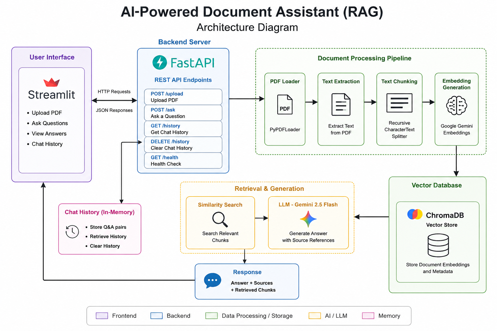

# 🤖 AI-Powered Document Assistant (RAG)

An AI-powered Document Assistant built using **FastAPI**, **Google Gemini**, **LangChain**, **ChromaDB**, and **Streamlit**. The application allows users to upload PDF documents and ask natural language questions. It retrieves relevant information from the uploaded document using Retrieval-Augmented Generation (RAG) and generates accurate answers with source references.

---

## 📌 Features

* 📄 Upload PDF documents
* 📑 Extract text from PDFs
* ✂️ Split documents into chunks
* 🧠 Generate embeddings using Google Gemini
* 🗄️ Store embeddings in ChromaDB
* 🔍 Retrieve relevant document chunks
* 🤖 Answer questions using Gemini 2.5 Flash
* 📍 Display source page references
* 💬 Chat History API
* 🖥️ Interactive Streamlit frontend

---

## 🛠️ Tech Stack

| Technology                     | Purpose              |
| ------------------------------ | -------------------- |
| FastAPI                        | Backend REST API     |
| Streamlit                      | User Interface       |
| LangChain                      | RAG Pipeline         |
| Google Gemini                  | Embeddings & LLM     |
| ChromaDB                       | Vector Database      |
| PyPDFLoader                    | PDF Text Extraction  |
| RecursiveCharacterTextSplitter | Document Chunking    |
| Python                         | Programming Language |

---

## 🏗️ System Architecture

The application follows a Retrieval-Augmented Generation (RAG) architecture.

1. User uploads a PDF.
2. PDF text is extracted.
3. Text is split into smaller chunks.
4. Embeddings are generated using Google Gemini.
5. Embeddings are stored in ChromaDB.
6. User asks a question.
7. Relevant chunks are retrieved using similarity search.
8. Gemini generates an answer using only the retrieved context.
9. The application returns:

   * Answer
   * Source Page(s)
   * Retrieved Chunks

> 📷 **Architecture Diagram**

Add your architecture diagram image here:

```text
architecture_diagram.png
```

Example:

```markdown

```

---

## 📂 Project Structure

```text
RAG-Document-Assistant/
│
├── app.py
├── streamlit_ui.py
├── requirements.txt
├── README.md
├── architecture_diagram.png
│
├── utils/
│   ├── chunker.py
│   ├── embeddings.py
│   ├── pdf_loader.py
│   ├── rag.py
│   └── vector_store.py
│
├── uploads/
├── chroma_db/
└── .env
```

---

## 🚀 Installation

### 1. Clone the repository

```bash
git clone https://github.com/ShreyaPathak87/RAG-Document-Assistant.git
cd RAG-Document-Assistant
```

### 2. Create a virtual environment

```bash
python -m venv .venv
```

### 3. Activate the environment

Windows

```bash
.venv\Scripts\activate
```

Linux / macOS

```bash
source .venv/bin/activate
```

### 4. Install dependencies

```bash
pip install -r requirements.txt
```

### 5. Create a `.env` file

```env
GOOGLE_API_KEY=your_google_api_key
```

---

## ▶️ Running the Application

### Start the FastAPI backend

```bash
python -m uvicorn app:app --reload
```

Swagger UI:

```
http://127.0.0.1:8000/docs
```

---

### Start the Streamlit frontend

```bash
streamlit run streamlit_ui.py
```

Streamlit URL:

```
http://localhost:8501
```

---

## 🔌 API Endpoints

| Method | Endpoint   | Description                               |
| ------ | ---------- | ----------------------------------------- |
| GET    | `/`        | Welcome message                           |
| POST   | `/upload`  | Upload a PDF                              |
| POST   | `/ask`     | Ask questions about the uploaded document |
| GET    | `/history` | Retrieve chat history                     |
| DELETE | `/history` | Clear chat history                        |
| GET    | `/health`  | Health check                              |

---

## 💬 Example API Response

### Ask Question

Request

```json
{
  "question": "What is my name?"
}
```

Response

```json
{
  "answer": "Shreya",
  "sources": [
    "Page 1"
  ],
  "retrieved_chunks": [
    "Hello my name is Shreya"
  ]
}
```

---

## 📸 Screenshots

Add screenshots of:

* Streamlit Home Page
* PDF Upload
* Question Answering
* Swagger UI

Example:

```markdown


```

---

## 🎥 Demo Video

Add your screen recording link here.

Example:

```
https://drive.google.com/...
```

---

## 🌟 Future Improvements

* Multi-document support
* Authentication
* Docker deployment
* Streaming responses
* Persistent chat history database
* Conversation memory

---

## 👩‍💻 Author

**Shreya B. Pathak**

Computer Science Engineering Student

---
